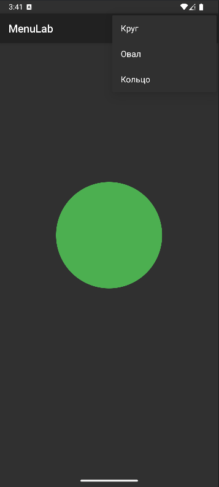

<div align="center">

# Отчёт

</div>

<div align="center">

## Практическая работа №9

</div>

<div align="center">

## Создание меню

</div>

**Выполнил:** Деревянко Артём Владимирович<br>
**Курс:** 2<br>
**Группа:** ИНС-б-о-24-2<br>
**Направление:** 09.03.02 Информационные системы и технологии<br>
**Проверил:** Потапов Иван Романович

---

### Цель работы
Изучить способы создания и обработки событий от различных типов меню в Android: главного меню (OptionsMenu) и контекстного меню (ContextMenu). Научиться динамически изменять интерфейс приложения с помощью пунктов меню.

### Ход работы
#### Задание 1: Создание проекта и подготовка интерфейса
1. Был открыт Android Studio и создан новый проект с шаблоном **Empty Views Activity**. Проекту дано имя `MediaLab`.
2. В файле `activity_main.xml` создан интерфейс, соответствующий варианту 1.
##### activity_main.xml
```xml
<?xml version="1.0" encoding="utf-8"?>
<LinearLayout xmlns:android="http://schemas.android.com/apk/res/android"
    android:layout_width="match_parent"
    android:layout_height="match_parent"
    android:orientation="vertical"
    android:gravity="center"
    android:padding="16dp">

    <ImageView
        android:id="@+id/imageView"
        android:layout_width="200dp"
        android:layout_height="200dp"
        android:layout_marginBottom="32dp"
        android:contentDescription="Отображение фигуры"/>

</LinearLayout>
```

#### Задание 2: Создание OptionsMenu
1. Создана папка `res/menu`
2. В ней создан файл `main_menu.xml`
3. Добавлено три пункта меню согласно варианту 1
##### main_menu.xml
```xml
<?xml version="1.0" encoding="utf-8"?>
<menu xmlns:android="http://schemas.android.com/apk/res/android"
    xmlns:app="http://schemas.android.com/apk/res-auto">
    <item
        android:id="@+id/action_circle"
        android:title="Круг"
        app:showAsAction="never"/>
    <item
        android:id="@+id/action_oval"
        android:title="Прямоугольник"
        app:showAsAction="never"/>
    <item
        android:id="@+id/action_ring"
        android:title="Кольцо"
        app:showAsAction="never"/>
</menu>
```
4. В `MainActivity.java` переопределён метод `onCreateOptionsMenu` для загрузки меню.
5. Переопределён метод `onOptionsItemSelected` для обработки выбора пунктов. В зависимости от выбранного пункта изменяется `ImageView`.
```java
@Override
public boolean onCreateOptionsMenu(Menu menu) {
    getMenuInflater().inflate(R.menu.main_menu, menu);
    return true;
}

@Override
public boolean onOptionsItemSelected(MenuItem item) {
    int id = item.getItemId();
    int shapeResId = -1;

    if (id == R.id.action_circle) {
        shapeResId = R.drawable.shape_circle;
    } else if (id == R.id.action_oval) {
        shapeResId = R.drawable.shape_oval;
    } else if (id == R.id.action_ring) {
        shapeResId = R.drawable.shape_ring;
    }

    // Если выбрана фигура, сохраняем в историю и применяем
    if (shapeResId != -1) {
        addToHistory(shapeResId);
        applyShape(shapeResId);
    }
    return true;
}
```

#### Задание 3: Создание ContextMenu
1. Выберан `ImageView`, для которого будет вызываться контекстное меню. Зарегистрировано в методе `onCreate` с помощью `registerForContextMenu()`.
```java
@Override
protected void onCreate(Bundle savedInstanceState) {
    super.onCreate(savedInstanceState);
    setContentView(R.layout.activity_main);

    imageView = findViewById(R.id.imageView);
    // Регистрация ImageView для вызова контекстного меню при долгом нажатии
    registerForContextMenu(imageView);

    // Установка начальной фигуры
    applyShape(R.drawable.shape_circle);
}
```
2. Переопределён метод `onCreateContextMenu` для создания меню.
```java
@Override
public void onCreateContextMenu(ContextMenu menu, View v, ContextMenu.ContextMenuInfo menuInfo) {
    super.onCreateContextMenu(menu, v, menuInfo);
    getMenuInflater().inflate(R.menu.context_menu, menu);
    menu.setHeaderTitle("Действия с фигурой");
}
```
3. Переопределён метод `onContextItemSelected` для обработки выбора.
```java
@Override
    public boolean onContextItemSelected(MenuItem item) {
        int id = item.getItemId();
        if (id == R.id.context_undo) {
            undo();
            return true;
        } else if (id == R.id.context_redo) {
            redo();
            return true;
        }
        return super.onContextItemSelected(item);
    }
```

#### Задание 4: Объединение и тестирование
1. Проверено, что главное меню появляется при нажатии на три точки в ActionBar.
2. Проверено, что контекстное меню появляется при долгом нажатии на `ImageView`.
3. Проверено, что все пункты меню выполняют задуманные действия.<br>
<br>
<br>
<br>


### Вывод
В результате выполнения практической работы были изучены способы создания и обработки событий от различных типов меню в Android: главного меню (OptionsMenu) и контекстного меню (ContextMenu). Получены навыки динамически изменять интерфейс приложения с помощью пунктов меню.

### Ответы на контрольные вопросы
1. **Какие типы меню существуют в Android? Опишите их назначение.**<br>
**OptionsMenu** (главное меню) — вызывается нажатием на кнопку меню в панели действий (ActionBar), используется для глобальных действий приложения (настройки, поиск, выход)<br>
**ContextMenu** (контекстное меню) — появляется при долгом нажатии на элементе интерфейса, предоставляет действия, специфичные для выбранного элемента<br>
**PopupMenu** (всплывающее меню) — привязано к определённому View и появляется по нажатию

---

2. **Как создать главное меню (OptionsMenu)? Какие методы необходимо переопределить в Activity?**
- Создать XML-файл в папке `res/menu/`
- Переопределить метод `onCreateOptionsMenu()` для загрузки меню: `getMenuInflater().inflate(R.menu.main_menu, menu)`
- Переопределить метод `onOptionsItemSelected()` для обработки выбора пунктов

---

3. **Для чего используется атрибут app:showAsAction? Какие значения он может принимать?**<br>
Определяет отображение пункта меню в ActionBar или выпадающем меню. Значения:<br>
`ifRoom` — отображать, если есть место<br>
`never` — всегда скрывать в меню<br>
`always` — всегда показывать (не рекомендуется)<br>

---

4. **Как зарегистрировать View для контекстного меню? В каком методе это обычно делается?**<br>
Вызвать метод `registerForContextMenu(View view)` для нужного элемента. Обычно делается в методе `onCreate()`.

---

5. **В чём разница между методами onCreateContextMenu и onContextItemSelected?**<br>
`onCreateContextMenu()` — создаёт/загружает контекстное меню (аналог `onCreateOptionsMenu()`)<br>
`onContextItemSelected()` — обрабатывает выбор пункта меню (аналог `onOptionsItemSelected()`)

---

6. **Как создать контекстное меню динамически (программно), без использования XML-ресурса?**<br>
Использовать метод `menu.add(groupId, itemId, order, title)` в методе `onCreateContextMenu()`:
```java
menu.add(0, 1, 0, "Пункт 1");
menu.add(0, 2, 1, "Пункт 2");
```

---

7. **Что возвращают методы onOptionsItemSelected и onContextItemSelected? Что означает возврат true?**<br>
Оба метода возвращают `boolean`. Возврат `true` означает, что обработка выполнена успешно и событие дальше не передаётся.

---

8. **Как определить, для какого именно элемента было вызвано контекстное меню, если зарегистрировано несколько View?**<br>
Использовать параметр `View v` в методе `onCreateContextMenu()` или `menuInfo` (например, `AdapterView.AdapterContextMenuInfo` для списков). Можно также проверять `v.getId()` для идентификации конкретного View.
